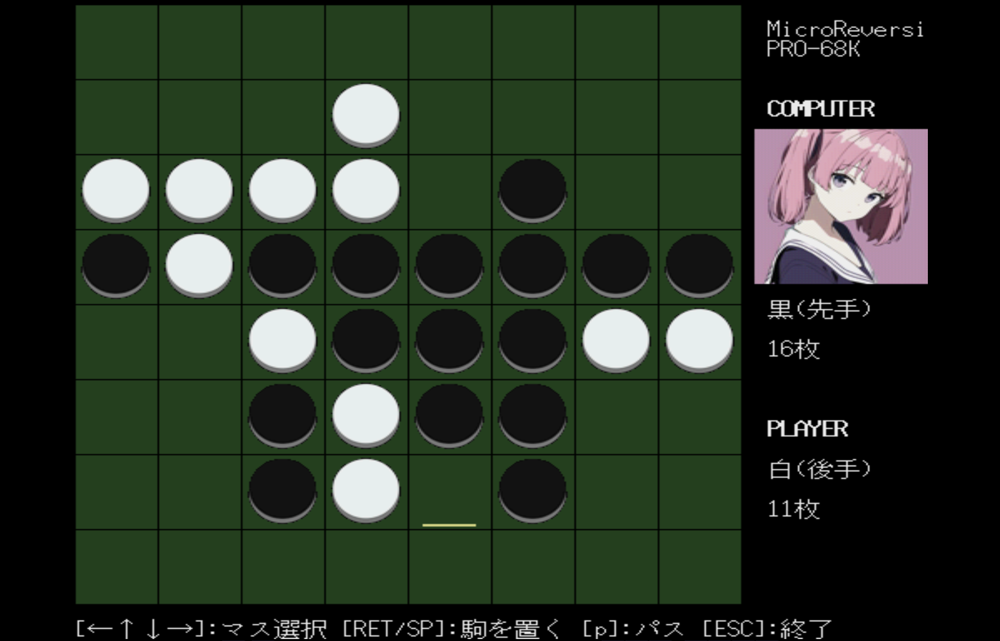

# Micro Reversi

Micro Reversi PRO-68K for X680x0/MicroPython

yunk氏の [MicroPython for X680x0](https://github.com/yunkya2/micropython-x68k/tree/port-x68k/ports/x68k) を使って実装したリバーシ(オセロ)です。対コンピュータの1人プレイ専用です。X68000Z EAKにも対応しています。

---

### インストール

- [MicroPython for X680x0](https://github.com/yunkya2/micropython-x68k/tree/port-x68k/ports/x68k) の最新版を導入しておく。

- [ureversi.lzh](https://github.com/tantanGH/ureversi/raw/main/ureversi.lzh) をダウンロードし、新規ディレクトリに展開する。

- 展開したディレクトリにカレントディレクトリを移し、`*.dat` ファイルと `ureversi.py` が存在するのを確認して、以下のコマンドで起動する。

        micropython ureversi.py

---

### X68000Z向け起動用XDF

- [X68Z_MicroReversi_20230502.XDF](https://github.com/tantanGH/ureversi/raw/main/xdf/X68Z_MicroReversi_20230502.XDF)

RAMDISKを作成し、そこに展開を行います。

X68000Z EAK 以外の環境で起動した場合は、最初に見つかったRAMDISKドライブに書き込みを行いますので注意してください。

---

### 遊び方

タイトル画面でスペースキーを押すとスタートします。先手(黒)と後手(白)はランダムに決まります。カーソルキーで黄色いカーソルを動かし、リターンキーまたはスペースキーで駒を置きます。置く場所が無い場合はpキーでパスすることができます。置ける場所がある場合はパスできません。双方置ける場所がなくなった場合は終了となります。
